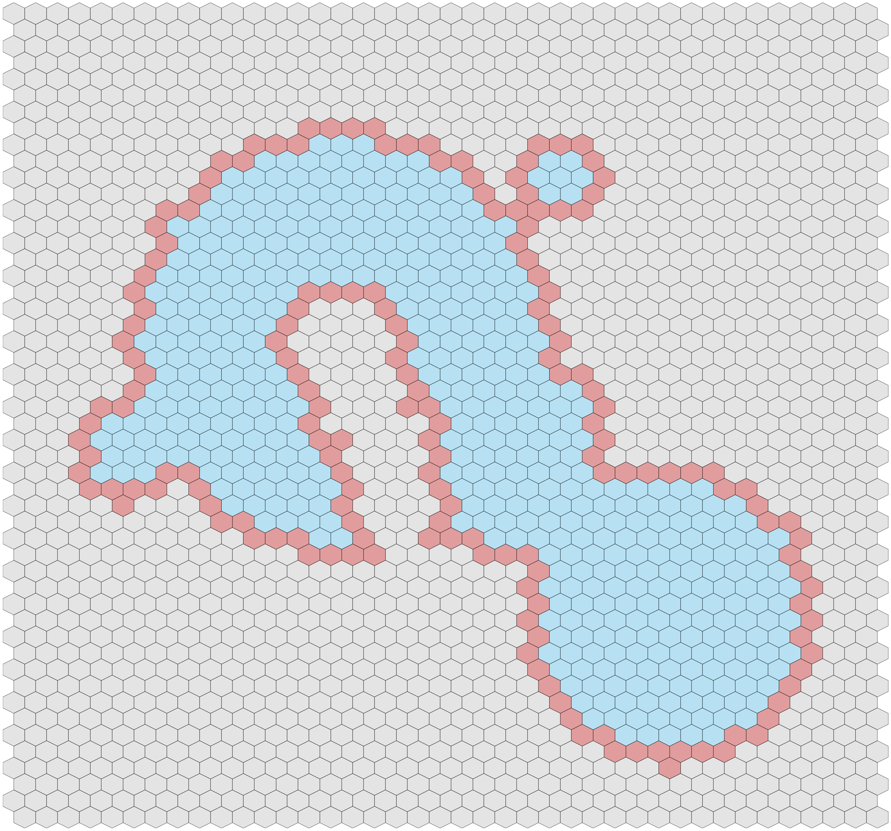
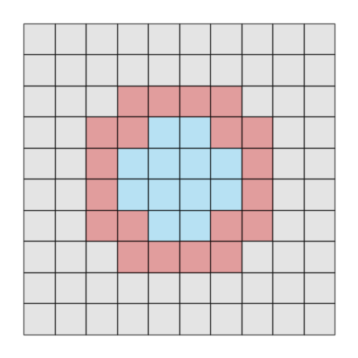
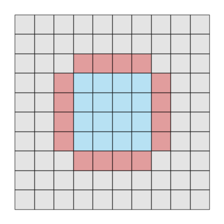
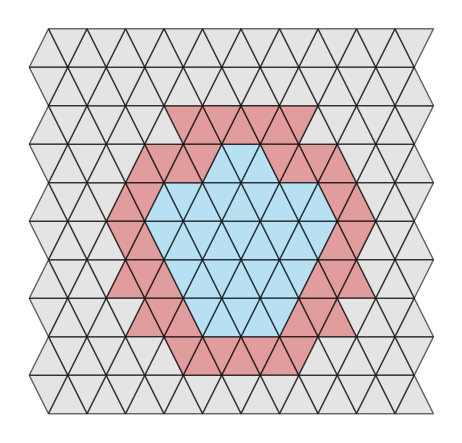
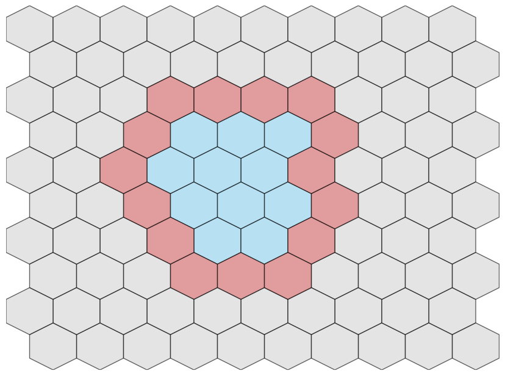

{align=right width="250"}

# Welcome to BorderTracer

An advanced border-tracing algorithm that generalizes classical image segmentation techniques from pixel-based grids to arbitrary polygonal tilings, enabling contour detection in abstract adjacency graphs.

---

## Features

<div class="grid cards" markdown>

- **Framework for abstract adjacency graphs**

    The algorithm works for very general adjacency graphs on abstract polygonal tilings. These can be given by Freeman codes, computed from geometric properties of the tiling, or determined directly.

- **Efficient tracing algorithms**

    The algorithms have linear time complexity in the size of the object border. Initialization depends largely on the implementation, but the framework is scalable and versatile.

</div>

## Quick Start

``` python title="Quick installation"
!git clone https://github.com/tonamatos/BorderTracer.git
%cd BorderTracer
from tracing import BorderTracer
```

## Examples

``` python title="Methods for producing examples"
from examples.objects import circular_object
from visualization import plot_tiling
```

!!! Tip

    Click on the tabs below to see the object and its computed border on different tiling graphs.

=== "4-adjacent squares"

    ``` python
    from examples.rectangular import RectangularTilingGraph

    # Create tiling and object
    G = RectangularTilingGraph()
    G.create_adjacencies(adjacency="4-adj")
    C = circular_object(G)

    # Apply the tracing algorithm
    bd = BorderTracer(G, C)
    result = bd.trace_border()
    G.highlight(result, color="indianred")
    plot_tiling(G)
    ```

    

=== "8-adjacent squares"

    ``` python
    from examples.rectangular import RectangularTilingGraph

    # Create tiling and object
    G = RectangularTilingGraph()
    G.create_adjacencies(adjacency="8-adj")
    C = circular_object(G)

    # Apply the tracing algorithm
    bd = BorderTracer(G, C)
    result = bd.trace_border()
    G.highlight(result, color="indianred")
    plot_tiling(G)
    ```

    

=== "3-adjacent triangles"

    ``` python
    from examples.triangular import TriangularTilingGraph

    # Create tiling and object
    G = TriangularTilingGraph()
    G.create_adjacencies(adjacency="3-adj")
    C = circular_object(G)

    # Apply the tracing algorithm
    bd = BorderTracer(G, C)
    result = bd.trace_border()
    G.highlight(result, color="indianred")
    plot_tiling(G)
    ```

    

=== "6-adjacent hexagons"

    ``` python
    from examples.hexagonal import HexagonalTilingGraph

    # Create tiling and object
    G = HexagonalTilingGraph()
    G.create_adjacencies(adjacency="6-adj")
    C = circular_object(G)

    # Apply the tracing algorithm
    bd = BorderTracer(G, C)
    result = bd.trace_border()
    G.highlight(result, color="indianred")
    plot_tiling(G)
    ```

    

## Theoretical background

Border tracing is an important segmentation method for two-dimensional digital image processing which determines the frontiers of objects. Boundary tracing algorithms are commonly first formulated for binary images where the object points have a special value in the image, while all other points, called _background points_, have another value. These algorithms are later combined with methods of object detection, such as filtering, edge detection or texture recognition. The _boundary_ of an object is expected to separate the object from the background, a contour is commonly a path of boundary elements.

The generalization from square pixels, which constitute the standard for 2D digital images, to polygonal tiles is justified by the notable attention that polygonal tilings, particularly rectangular, triangular and hexagonal tilings, have received for several decades as alternative model to 2D digital images. Such tilings have been employed, for example, to study the preservation of topological properties during thinning. Rectangular and triangular tilings are special cases of the polygonal tilings used to analyse convexity properties of digital objects and to develop its representation via the minimal perimeter polygon. Triangular and hexagonal pixels have been explicitly employed, for example, in the following:

  - to develop tools for image processing and image modelling;
  
  - to design thinning algorithms that preserve topological and geometrical properties of the objects of interest;

  - to perform geometrical transformations, to define geometrical figures such as straight lines or circular arcs, and to study shortest paths;
  
  - to design digital distance functions with applications in distance transformations employed for skeletonization;

  - special coordinate systems to handle triangular and hexagonal pixels were proposed;
  
  - triangular pixels were suggested for graphical data visualization; and
  
  - representations of objects in digital images as unions of polygonal tiles, independently from the "geometrical form" of the pixels, can be useful in the classification or recognition of the objects.

## References

This framework was developed by Tonatiuh Matos-[Wiederhold.dev](https://wiederhold.dev) as part of the upcoming research paper:

 > Wiederhold, P., Matos-Wiederhold, T., _Border tracing in oriented adjacency graphs of polygonal tilings with application to objects made of rectangular, triangular or hexagonal tiles_, submitted to **Theoretical Computer Science**, 2025.